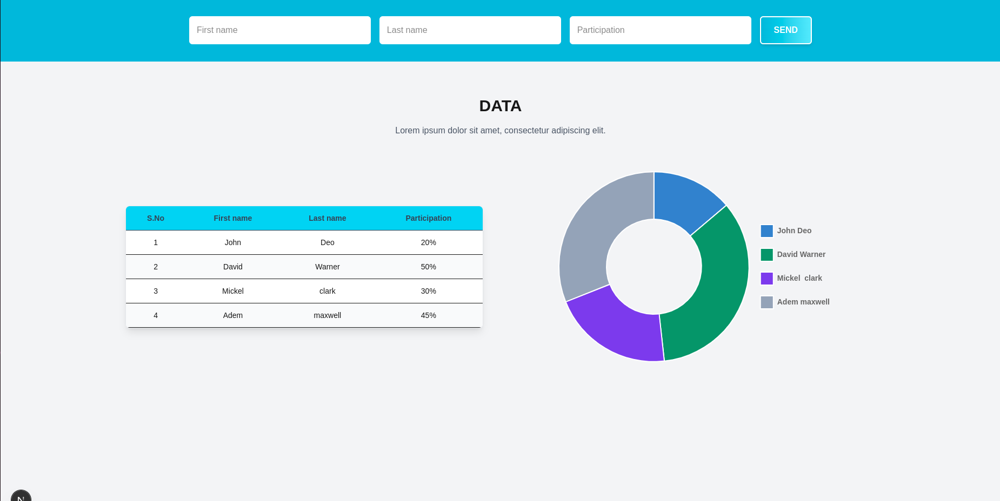

# 🔋 Fullstack Challenge – Participation Form & Dashboard

This is a **fullstack web application** built as part of the coding challenge.  
It includes a **Next.js** and a **Node.js + Prisma backend** with a PostgreSQL database.

The app provides a form to collect participation data, displays the data in a table with percentage calculations, and visualizes it using charts.

---

## 🖥️ Tech Stack

**Frontend (client):**

- ⚛️ Next.js (App Router)
- ⚛️ React + TypeScript
- 🎨 Tailwind CSS
- 📊 Chart.js
- 📝 React Hook Form

**Backend (api):**

- 🟩 Node.js
- 🚏 Express.js
- 📘 TypeScript
- 🗂️ Prisma ORM
- 🐘 PostgreSQL
- ✅ JOI validation

**Dev Tools:**

- 📦 pnpm
- 🐳 Docker + docker-compose
- ✨ ESLint + Prettier
- 🐶 Husky (git hooks)

---

## 🌐 Features

- 🔐 **Form Submission**: Users can submit participation details via a structured form
- 📋 **Data Table**: View all submitted entries with percentage distribution
- 📈 **Chart Visualization**: Graph representation of participation data
- 🚦 **Validation & Errors**: Returns structured JSON error messages for invalid data
- 🧪 **Testing Ready**: Support for adding unit/integration tests

---

## 📁 Project Structure

```
├── api/                  # Backend service
│   ├── prisma/           # Prisma schema & migrations
│   ├── src/              # API source code
│   │   ├── services/
│   │   ├── routes/
│   │   ├── controllers/
│   │   └── index.ts
│   ├── package.json
│   └── tsconfig.json

├── client/               # Frontend service
│   ├── app/              # Next.js app router
│   ├── components/
│   ├── public/
│   ├── package.json
│   └── next.config.ts

├── docker-compose.yml    # Multi-service setup
├── pnpm-workspace.yaml   # Monorepo setup
└── README.md
```

---

🧪 Development Environment Used

| Tool    | Version      |
| ------- | ------------ |
| Node.js | v20.19.0     |
| PNPM    | v10.14.0     |
| Docker  | v28.1.1      |
| OS      | Ubuntu 23.04 |

---

## ⚙️ Environment Variables

Create a `.env` file inside both **api/** and **client/**:

**📡 api/.env**

```env
# 🚀 Server Config
PORT=5000

# 🐘 PostgreSQL Config
POSTGRES_USER=user
POSTGRES_PASSWORD=user_password
POSTGRES_DB=user_database
POSTGRES_HOST=localhost
POSTGRES_PORT=5433

# 🔗 Prisma Connection URL
DATABASE_URL="postgresql://${POSTGRES_USER}:${POSTGRES_PASSWORD}@${POSTGRES_HOST}:${POSTGRES_PORT}/${POSTGRES_DB}?schema=public"
```

**🎨 client/.env**

```env
# 🌍 API Endpoint
NEXT_PUBLIC_API_URL=http://localhost:5000
```

---

## 🚀 Running the App

### 2️⃣ Install dependencies

At the root of the project:

```bash
pnpm install
pnpm run build:prisma
```

### 3️⃣ Run with Docker

```bash
docker-compose up
```

### 4️⃣ Run manually with pnpm workspaces

Run both frontend & backend together:

```bash
pnpm run dev
```

Run individually:

Start backend:

```bash
pnpm --filter api dev
```

Start frontend:

```bash
pnpm --filter client dev
```

App will be running at:  
👉 Frontend: `http://localhost:3000`  
👉 Backend: `http://localhost:5000`

---

🧪 Running Tests

This project uses Jest with support for both frontend (client) and backend (api) tests.
Tests can be run individually or all at once from the monorepo root.

Run all tests

```bash
pnpm run test
```

Run frontend (client) tests only

```bash
pnpm run test:client
```

Run backend (api) tests only

```bash
pnpm run test:api
```

---

## 📝 Developer Notes

## Architecture Decisions

### Backend with Express.js instead of Next.js API routes

- Maintains a clear separation of concerns between frontend (Next.js) and backend (Express).

- Improves maintainability, scalability, and flexibility of the project.

- Allows independent deployments of frontend and backend services.

- Provides easier integration with databases, authentication, and custom middleware.

- Enables support for multiple clients (web, mobile, etc.) using the same backend.

- Gives a cleaner structure for larger teams and long-term project growth compared to keeping both layers tightly coupled in Next.js.

### Partial Hydration with React Server Components

- Client-side interactivity is isolated only to the PieChart component (marked "use client").

- The DataTable remains a server component, rendered on the server without shipping unnecessary JavaScript to the browser.

- Ensures only components that require browser APIs (chart.js) are bundled and hydrated on the client.

- Reduces client-side JavaScript payload and improves rendering performance.

- Creates a clearer separation between interactive and non-interactive UI concerns.

- Aligns with modern React Server Components (RSC) architecture best practices for efficiency.

## Screenshot


